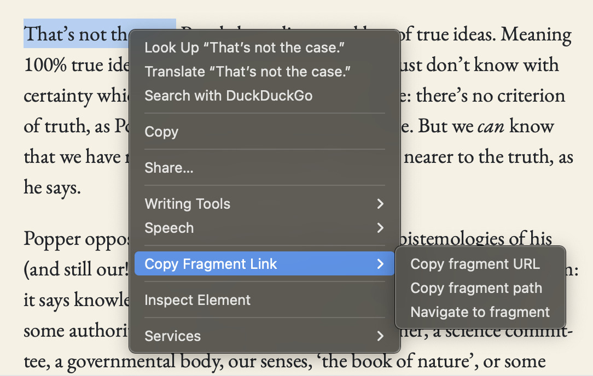

# Copy Fragment Link

Fragment links direct people to specific passages on a page. While Safari currently understands such links and highlights the corresponding text, it does not offer a built-in way to *generate* such links. That’s where this extension comes in.

The *Link to Text Fragment* Extension for Safari is broken so I decided to make my own.

As a bonus, I’m including two new features: copying the *path* to a fragment (eg `/path/to#:~:text=fragment`) and *navigating* to a fragment.

## Usage

Highlight some text, right click on it, then select one of three options:

## Installation

1. Allow unsigned extensions to run in Safari.
2. Git clone.
3. Build and run using Xcode.
4. Make sure that Copy Fragment Link is enabled in the list of Safari extensions.

## Limitations

Fragment links work on *most* sites but not all. Some elements (eg iframes) interfere with fragments. In addition, text fragments can break navigation in single-page apps. The extension uses heuristics to disambiguate and highlight the specified text but may instead highlight repeat text on the same page. Use with caution.

## License

[Adjusted MIT.](License)
